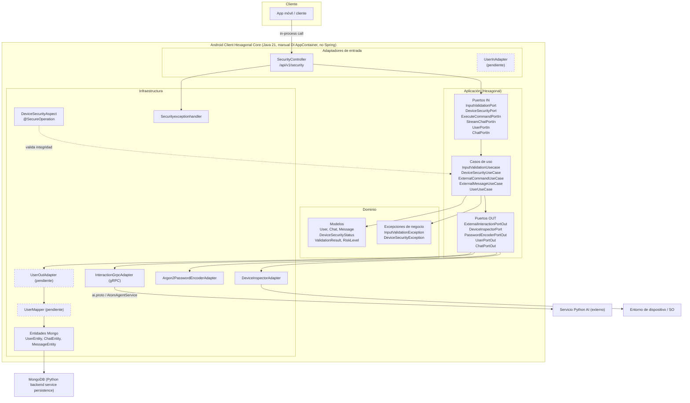

# Architecture Flow [Atom]

This diagram shows Atom's hexagonal architecture and request flow — from the mobile client through the Android client's hexagonal core (inbound adapters, application ports/use-cases, domain, and infrastructure) out to the Python AI service over gRPC and MongoDB persistence.

